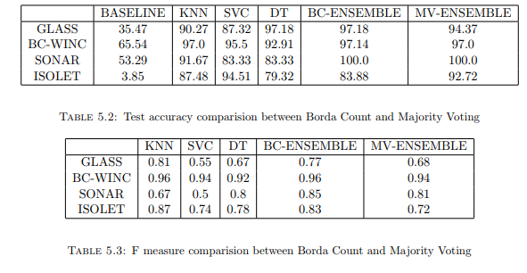

### Borda Count

[Borda Count](https://www.electoral-reform.org.uk/voting-systems/types-of-voting-system/borda-count/) is a voting technique generally used in elections but rarely used in ensemble voting. This Jupyter notebook takes 4 datasets and observes the performance of Borda Count over Majority Voting.

### Results

