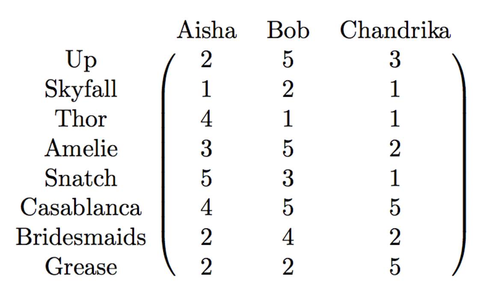
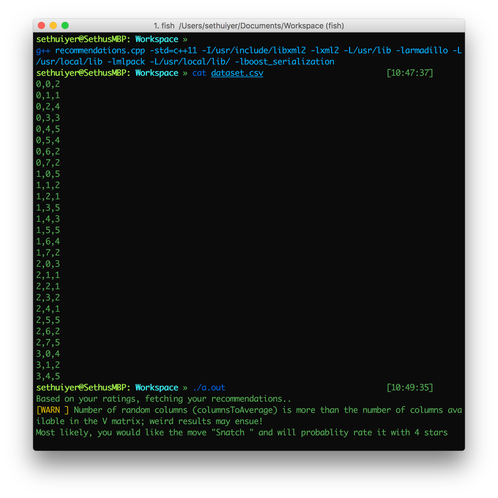

#Collaborative Filtering in C++

This code contains the implementation of simple collaborative filtering recommender system in C++ which uses mlpack, the C++ machine learning library.

#Usage

Download this folder. Set up mlpack on your system. Go to their website for installing it in your system.

After installing mlpack, execute this command in the terminal

`g++ recommendations.cpp -std=c++11 -I/usr/include/libxml2 -lxml2 -L/usr/lib -larmadillo -L/usr/lockal/lib -lmlpack -L/usr/local/lib/ -lboost_serialization`

which links all necessary files.

The matrix on which SVD is done is shown by this picture.

where the (i,j) entry denotes the rating of movie i by user j.
The output is shown by this picture.

where dataset.csv has rows containing user id, movie id, rating.