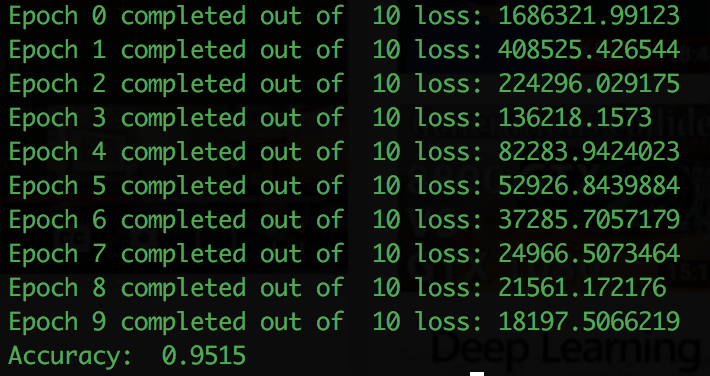
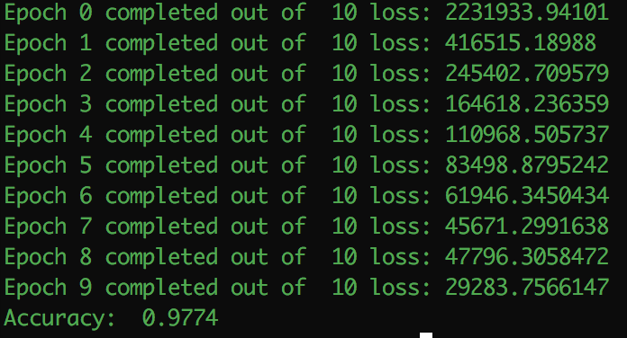
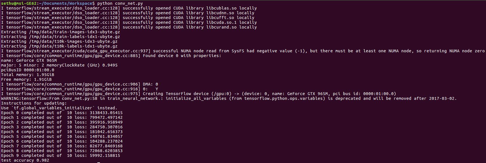
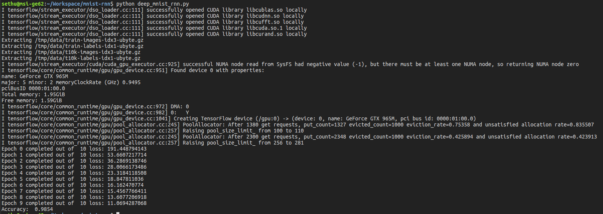

#Deep MNIST

Just my attempt to construct a deep neural net with ReLU activation units using tensorflow to classify the digits of MNIST dataset.

`deep_mnist.py` contains a feedforward neural network and `deep_mnist_conv.py` contains 2-D convolutional network.
`deep_mnist_rnn.py` has LSTM network tackling MNIST dataset

###Output
*  Without Convolution Neural Networks

Pretty bad with respect to industry standards but pretty good with respect to the model used.

* With Convolutional Neural Networks 

Not that good with respect to the industry standards as well as the model taken.

* With Convolutional Neural Networks and GPU

GPU did help to increase the accuracy a little bit, but still far away from the state of art.

* With Recurrent Neural Networks

Similar to conv net performance
