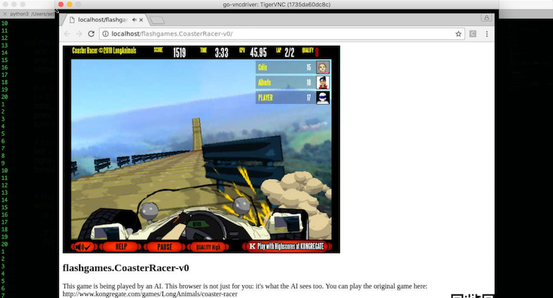

##Game Bot using OpenAI Gym

A simple game bot using OpenAI's gym and universe which plays the game 'Coaster Racer'.
####Steps to simulate

Install Gym, universe and Docker.

Run`docker run -p 5900:5900 -p 15900:15900 --cap-add SYS_ADMIN --ipc
 host --privileged quay.io/openai/universe.flashgames:0.20.8`

Run `python bot.py`

#### Output

Takes 4 minutes to complete a lap, clearly says how naive the bot is.
###TODO
* Add a Deep Q-Learning bot using Tensorflow