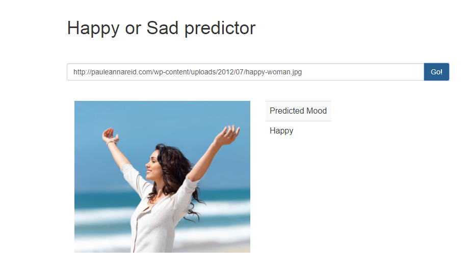

# Happy or Sad Webapp

A simple Flask based webapp where you paste the url of an image and it gives you the prediction wheather the person in the image is happy or sad

## Dependencies

	Keras
	Opencv 3.1
	Flask
  	Tensorflow

## How to Run

	python app.py
