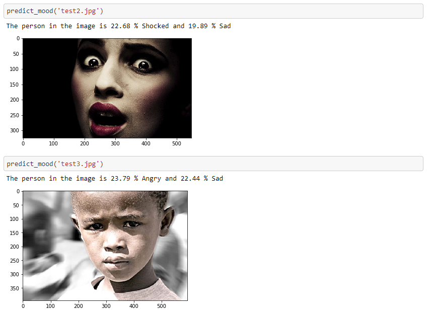

## Multi Emotion Detector

Detects Anger, Disgust, Happiness, Sadness, Shocked and Sadness.

Motive of this sub-repo is to provide people an easy working example of using Transfer Learning on Custom Datasets using Keras

#### Output

