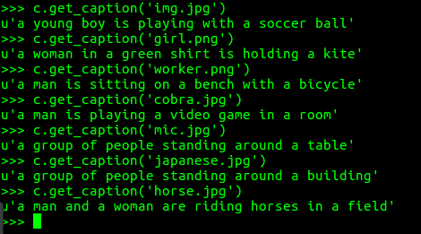

## Neural Image Caption Generator
**What it does** : Generates Caption from Images 

**How?** : Using Keras, it extracts the top fully connected layer of VGG 16 and passes that information to the LSTM network which generates the caption.

**Output** : 

Here is the img.jpg for which the caption is 'a young boy is playing with a soccer ball' 

