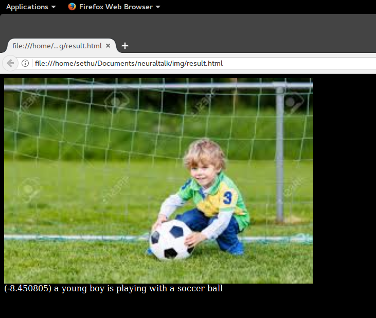

## Neural Image Caption Generator

Code to fetch the image caption from images. Uses code from [Neuraltalk](https://github.com/karpathy/neuraltalk) repository.

## Output

## Changes Done
1. `capgen.py` written which pre processes the image and generates the caption using pre trained models
2. Added a Search engine based on elasticsearch which returns images based on the matching descriptions. Code can be seen in `description_search` folder.

## Problems
1. The weights are not being loaded in the caffe net due to inconsistences in `deploy_features.prototxt`

## Solution
Used Keras to extract the image features and caffe to generate the description. Code can be seen in `extract_feats.py`
