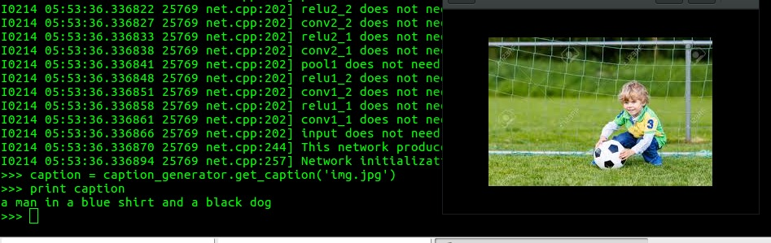

##Neural Image Caption Generator

A small python function written to fetch the image caption from images. Uses code from [Neuraltalk](https://github.com/karpathy/neuraltalk) repository.

##Output

##Changes Done
1. `capgen.py` written which pre processes the image and generates the caption using pre trained models
2. Added a Search engine based on elasticsearch which returns images based on the matching descriptions

##Problems
1. `py_caffe_extract_features.py` is not extracting the features correctly from the VGG-16 network.