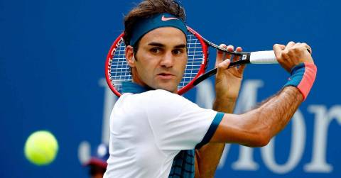
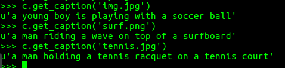

## Neural Image Caption Generator

**What it does** : Generates Caption from Images 

**How?** : Using Keras, it extracts the top fully connected layer of VGG 16 and passes that information to the LSTM network which generates the caption.

 **Test Images**
 <table>
  <tr>
 <td> img.jpg </td>
 <td> surf.png </td>
 <td> tennis.jpg </td>
 </tr>
 <tr>
 <td>
 
 </td>
 <td>
 
 </td>
 <td>
 
 </td>
 </tr>
 </table>
 
 and this is their caption
 

To Understand how this works: [Understanding Image Captioning](https://github.com/sethuiyer/deep-image-search-course/blob/master/Week_5%20Understanding%20Image%20Captioning.pdf)

