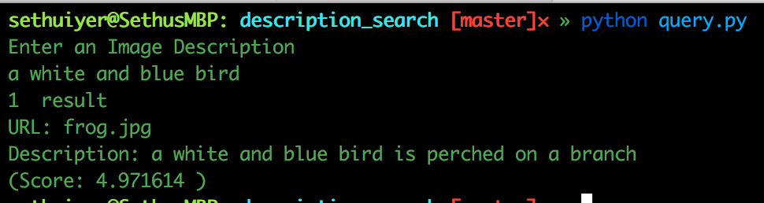
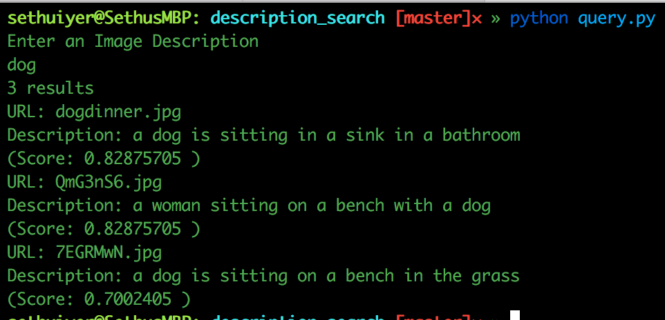

# Description Search

After running `python eval_on_images.py`, a `result_struct.json` file is produced which has all the informations about kind of network used and their parameters for the prediction etc. What we are interested in is the image description and the URL.

##Usage
1. Download [Elastic Search](https://www.elastic.co/). In this case, I have used Elastic Search 5.1.2 . Download the zip and after unzipping it, do `cd elasticsearch-5.1.2/`
2. `pip install elasticsearch-py`
3. Start the Elastic Search Server by typing `bin/elasticsearch` in the terminal
4. Now, Open a new tab in terminal, do `python index.py` to index the necessary items in the server
5. Now, Execute `query.py` to query the description against the image.

## Output

